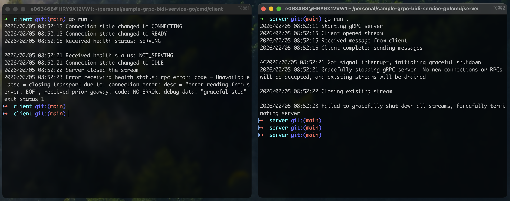
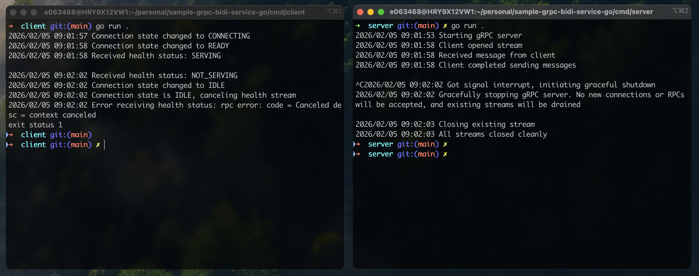

# Sample Bidi Service

This project exists to demonstrate a potential point of confusion with the gRPC-Go library. The full context of the
issue can be found on this [GitHub Issue](https://github.com/grpc/grpc-go/issues/8776).

## Example 1

Client code takes no explicit action to close the `/Watch` health stream during server shutdown.

Server's graceful shutdown fails, and the server is ultimately required to forcefully terminate the hanging health stream:

## Example 2

Client code observes the connection state, and upon connection going IDLE, explicitly cancels the health stream.

Server's graceful shutdown succeeds, and the server is not required to forcefully terminate any streams:

